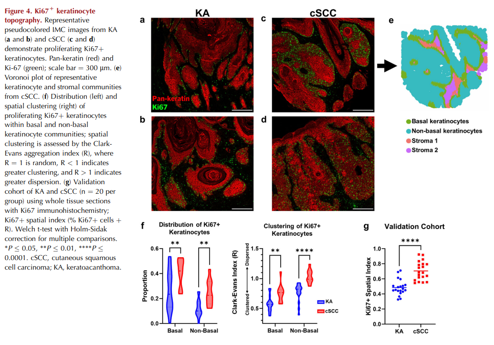

# Distinguishing Keratoacanthoma from Well-Differentiated Cutaneous Squamous Cell Carcinoma Using Single-Cell Spatial Pathology

## Introduction
Keratoacanthoma type cSCC (KA) 
* masquerades as a more aggressive
* rapidly growing cSCC
* but exhibits benign behavior 
* can be successfully managed with nonsurgical treatment

## Transcriptomic profiles differ between KA and cSCC
Genes upregulated in KA:
* WNT2 - KA development (Zito et al., 2014)
* KRT2 - suprabasal keratins, differential keranocyte maturation and survival between KA nas cSCC

## IMC and identification of single-cell clusters
* IMC panel: 39 markers for keratinocyte, immune, endothelial, stromal lineages & functional status
* Samples: KA (n=16) & cSCC (n=11), 61 ROIs → 479,026 single cells
* 35 clusters grouped into 17 meta-clusters
* **KA enriched**: CD4⁺ T cells, fibroblasts, vasculature
* **cSCC enriched**: Ki67⁺ keratinocytes, Ki67⁻ basal keratinocytes

## KA and cSCC are composed of differing keratinocyte populations
* cSCC: higher Ki67⁺ keratinocytes (29% vs 15.5%, p=0.003) & Ki67⁻ basal keratinocytes (27.2% vs 15.6%, p=0.01)
* KA: higher K10-high keratinocytes (43.5% vs 22.5%, p=0.01) → resembles normal skin maturation
* TP63: elevated in cSCC Ki67⁺ keratinocytes (0.84 vs 0.73, p=0.03)
* CIBERSORTx:
    * cSCC → more undifferentiated & tumor-specific keratinocytes
    * KA → lacked malignant keratinocyte signature

## Ki67⁺ keratinocyte topography
* KA: Ki67⁺ cells mainly in basal layer
* cSCC: more frequent (24.6% vs 12.4%, p=0.005) & dispersed in non-basal keratinocytes (dispersion R=0.77 vs 0.58, p<0.0001)
* Validated via IHC in independent cohort (n=20 each) → higher Ki67⁺ spatial index in cSCC

## Tumor microenvironment (TME) differences
* **KA**: more resting CD4⁺ & CD8⁺ T cells
* **cSCC**: more Tregs (33.7% vs 22%, p=0.021), activated CD8⁺ T cells (30.1% vs 18.2%, p=0.045)
* cSCC immune cells show more activation (Ki67, CD69), but CD4⁺ T cells also express more PD-L1 → linked to inducible Tregs
* Tregs in cSCC: ↑ Foxp3 (1.77 vs 1.55, p=0.014), ↑ CCR6 → more suppressive capacity & recruitment
* Macrophages in cSCC: ↑ PD-L1 (0.31 vs 0.22, p=0.024), ↑ MMP10 in stroma
* Spatial associations in cSCC: Ki67⁺ keratinocytes + Tregs, macrophages, neutrophils, fibroblasts → supports immunosuppressive, cancer-associated fibroblast–linked TME

